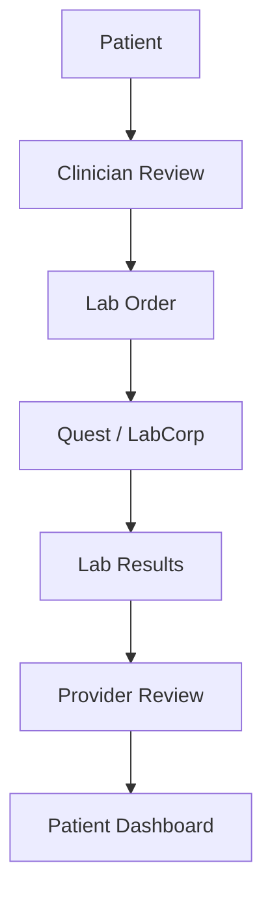

# Healthcare Lab Testing Platform

Full-stack healthcare lab testing platform for managing lab orders, lab
integrations, result ingestion, biomarker history, and a patient-facing
dashboard.

The project is designed around clean architecture, strong TypeScript boundaries,
Firestore-oriented JSON data modeling, and isolated FHIR/HL7 integration
adapters.

## Product Overview

The application supports a diagnostic workflow:

- A clinician creates a lab order for a patient.
- The backend routes the order to a lab-specific adapter.
- LabCorp is represented with a FHIR-style integration.
- Quest Diagnostics is represented with an HL7 v2-style integration.
- Incoming results are normalized into internal biomarker history.
- The patient dashboard reads structured lab history from the backend API.

The platform solves three practical healthcare problems:

- Lab orders need consistent lifecycle management.
- Lab vendors use different interoperability formats.
- Patients and clinicians need longitudinal biomarker history, not raw vendor
  messages.

## Current Scope

- Node.js, Express, TypeScript backend
- React, TypeScript, Vite frontend
- Strict TypeScript configuration
- Domain models for patients, providers, labs, panels, biomarkers, orders,
  results, billing, audit, and compliance metadata
- APIs for lab orders, patient history, biomarker history, result ingestion,
  recent results, and patient dashboard data
- Lab adapter abstraction with Quest, LabCorp, and local implementations
- JSON seed files shaped like Firestore collections
- Runtime-only JSON writes for local development behavior
- Connected patient dashboard using a typed frontend API client

## Workflow



## Architecture

```text
React dashboard
  -> frontend API client
    -> Express controller
      -> application service
        -> use case
          -> repository / integration ports
            -> JSON files and lab adapters
```

Backend dependency rule:

```text
interfaces/http -> application -> ports -> domain
infrastructure -> ports/domain
```

Why each layer exists:

- Domain: healthcare vocabulary and Firestore-friendly document shapes.
- Application: workflow orchestration such as create order, receive result, and
  compose patient dashboard data.
- Ports: dependency inversion for repositories, integrations, clocks, IDs, and
  mappers.
- Infrastructure: JSON repository adapters and lab-specific FHIR/HL7 adapters.
- Interfaces: HTTP delivery, validation, response DTOs, and error handling.
- Frontend API client: keeps React components from knowing HTTP envelope details.

## Folder Structure

```text
backend/
  src/
    app/                  composition root, Express app, routes
    domain/               healthcare domain models
    application/          use cases, services, dashboard composition
    ports/                repository, integration, mapper, service interfaces
    infrastructure/       JSON repositories, lab adapters, observability
    interfaces/http/      controllers, DTOs, presenters, middleware

frontend/
  src/
    api/                  typed API client
    features/
      patient-dashboard/  dashboard components, parser, service
    styles/               dashboard styles
```

## Running Locally

Install dependencies:

```bash
npm install
```

Run backend:

```bash
npm run dev:backend
```

Run frontend:

```bash
npm run dev:frontend
```

Default URLs:

- Backend: `http://localhost:4000`
- Frontend: `http://localhost:5173`

Useful environment variables:

- `PORT`: backend port, default `4000`
- `LAB_PLATFORM_ALLOWED_ORIGINS`: comma-separated allowed frontend origins
- `LAB_PLATFORM_DATA_DIR`: optional path to JSON seed files
- `VITE_LAB_PLATFORM_API_BASE_URL`: frontend API base URL
- `VITE_LAB_PLATFORM_PATIENT_ID`: dashboard patient id, default `patient_001`

Verify:

```bash
npm run typecheck
npm test
npm run build
npm audit
```

## API Examples

Create lab order:

```bash
curl -X POST http://localhost:4000/api/lab-orders \
  -H "content-type: application/json" \
  -H "x-actor-id: provider_001" \
  -H "x-actor-role: provider" \
  -d '{
    "patientId": "patient_001",
    "labId": "lab_labcorp",
    "panelIds": ["panel_lipid"],
    "orderingProvider": {
      "id": "provider_001",
      "name": "Dr. Taylor Reed",
      "npi": "1234567890"
    },
    "billingType": "self_pay",
    "idempotencyKey": "order-001"
  }'
```

Get patient dashboard:

```bash
curl http://localhost:4000/api/patients/patient_001/dashboard
```

Get biomarker history:

```bash
curl http://localhost:4000/api/patients/patient_001/biomarkers/biomarker_ldl/history
```

Receive lab result:

```bash
curl -X POST http://localhost:4000/api/labs/lab_labcorp/results \
  -H "content-type: application/json" \
  -d '{ "kind": "FHIR", "report": { "...": "..." } }'
```

API responses use a Result envelope:

```json
{ "ok": true, "data": {} }
```

```json
{
  "ok": false,
  "error": {
    "code": "not_found",
    "message": "LabOrder 'missing' was not found"
  }
}
```

## Healthcare Assumptions

- Lab results are clinical inputs for provider review, not automatic diagnoses.
- Providers review clinically meaningful outputs before patient-facing treatment
  changes.
- LOINC is the preferred cross-lab biomarker coding system.
- UCUM-style units are preferred for numeric observations.
- Accession numbers and source message IDs are required for lab reconciliation.
- Patient dashboard content should remain educational and non-diagnostic.
- Treatment programs, prescriptions, refill checks, and fulfillment records can
  be added as separate workflow models.

## FHIR and HL7

FHIR and HL7 are modeled as interoperability boundaries, not as internal domain
models.

FHIR-style LabCorp flow:

- `LabOrder` maps to a simplified `ServiceRequest`.
- FHIR-style `DiagnosticReport` and observations map to normalized
  `LabResult` records.
- LOINC/source codes normalize external observations into internal biomarkers.

HL7-style Quest flow:

- `LabOrder` maps to an ORM-style message.
- ORU messages are parsed through `MSH`, `PID`, `ORC`, `OBR`, and `OBX`
  segments.
- `OBX` observations become normalized biomarker results.

Production systems would require real FHIR R4 resource validation, HL7 v2
conformance handling, ACK/NACK flows, vendor specifications, and integration
testing with each lab.

## Firestore Migration Strategy

The current project intentionally uses JSON files shaped like Firestore
collections:

```text
patients.json
labs.json
testPanels.json
biomarkers.json
labOrders.json
labResults.json
auditEvents.json
```

Migration path:

1. Keep repository ports unchanged.
2. Add Firestore repository implementations beside the JSON repositories.
3. Add Firestore indexes for common reads:
   - `labOrders`: `patientId`, `status`, `createdAt`
   - `labResults`: `patientId`, `resultedAt`, `labOrderId`
   - `labResults`: `sourceMessageId` for idempotency
   - biomarker history support through denormalized biomarker ids or a separate
     observation read model
4. Use Firestore transactions for result save plus order status update.
5. Add security rules, service accounts, and environment-based configuration.

## Security Considerations

Current safeguards:

- `helmet` middleware
- CORS allowlist for local development and environment configuration
- Zod validation at HTTP boundaries
- Sanitized error responses
- Correlation IDs and actor metadata for audit events
- No intentional PHI logging

Production requirements:

- Real authentication, such as Firebase Auth or OIDC
- RBAC/ABAC for patients, providers, admins, labs, and support roles
- Webhook signature verification or mTLS for lab callbacks
- Replay protection for inbound lab messages
- Rate limiting and abuse protection
- Secrets in a managed secret store
- Encryption at rest and in transit
- PHI access audit reports
- BAAs with vendors that create, receive, maintain, or transmit ePHI

## Known Limitations

- JSON files simulate Firestore; there is no real database connection.
- Runtime writes are in memory only and are not persisted back to disk.
- FHIR mapping is simplified and not full FHIR R4.
- HL7 parsing is simplified and not full HL7 v2 conformance.
- There is no real Quest or LabCorp network integration.
- There is no authentication.
- There is no RBAC or patient/provider authorization.
- There is no webhook signature verification.
- There is no provider review queue before patient result release.
- There is no treatment program, prescription, refill, or pharmacy fulfillment
  model yet.
- This project is not HIPAA-compliant production software.

## Future Improvements

- Add Firestore repository implementations.
- Add Firestore indexes, transactions, and security rules.
- Add authentication and RBAC.
- Add webhook signature verification and replay protection.
- Add real FHIR R4 validation and richer resource mapping.
- Add real HL7 parser support, ACK/NACK handling, and vendor conformance tests.
- Add provider review queue for abnormal results and treatment eligibility.
- Add treatment program and treatment plan models.
- Add medication fulfillment and refill safety workflows.
- Add patient lab preparation and result detail pages.
- Add audit report views for compliance/admin users.

## Additional Documentation

- Backend API architecture: `backend/API_ARCHITECTURE.md`
- Domain model guide: `backend/src/domain/DOMAIN_MODEL_GUIDE.md`
